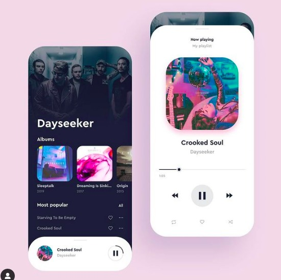
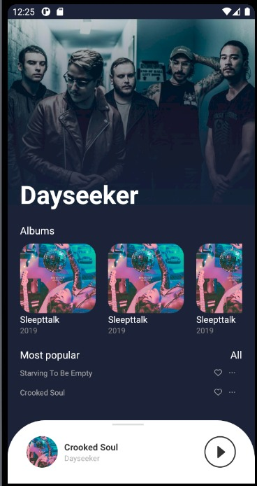

# React Native clone

React Native UI clone made with Expo, styled-components, react-native-gesture-handler

### Ui project

> design by [@aleksandesign](https://www.instagram.com/aleksandesign/)

### Final project

## Author

👤 **Rennan Prysthon**

- Github: [@rennanprysthon](https://github.com/rennanprysthon)
- LinkedIn: [@rennanprysthon](https://linkedin.com/in/rennanprysthon)
